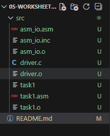
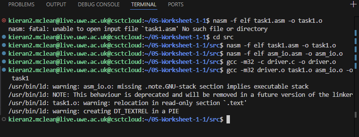
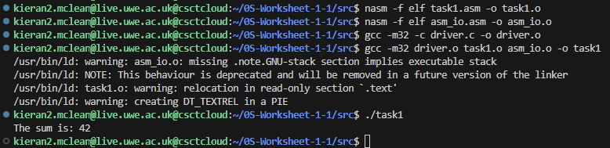

# 0S-Worksheet-1

In this Worksheet I was introduced to basic x86 assembly programming using NASM and it shows how assembly functions can be called from C.

my final code structrure looks like this



Source Code:

```c
int __attribute__((cdecl)) asm_main(void);

int main() {
    int ret_status;
    ret_status = asm_main();
    return ret_status;
}
```
### task1.asm

this is my implementations of the assembly program that adds two numbers and prints the result.

```
%include "asm_io.inc"

segment .data
    a   dd 10
    b   dd 32
    msg db "The sum is: ", 0

segment .text
    global asm_main

asm_main:
    enter 0, 0
    pusha

    mov eax, [a]
    add eax, [b]

    mov ebx, eax

    mov eax, msg
    call print_string

    mov eax, ebx
    call print_int
    call print_nl

    popa
    mov eax, 0
    leave
    ret
```


How the assembly code works?

1. Data segment
    a   dd 10
    b   dd 32
    msg db "The sum is: ", 0
a nad b are integers stored in memory.

msg is a null terminated string for printing 

2. Making the function visible to C
    global asm_main
This allows the GCC linker to find the asm_main fucntion

without this line, you get an error response:
undefined reference to 'asm_main'

3. Stack setup 
    enter0, 0
    pusha
this creates a stack frame and saves registers

4. Adding the Two integers
    mov eax, [a]
    add eax, [b]
the result is stored in eax, then moved to ebx for printing

5. Printing the output
    mov eax, msg
    call print_string

    mov eax, ebx
    call print_int
    call print_nl
These print the string and integer result using fucntioons from asm_io

6. Function exit
    popa
    mov eax, 0
    leave
    ret
restores registers and returns to the C program

7. Compilation process
the following commands were used inside hte src/directory
    nasm -f elf task1.asm -o task1.o
    nasm -f elf asm_io.asm -o asm_io.o
    gcc -m32 -c driver.c -o driver.o
    gcc -m32 driver.o task1.o asm_io.o -o task1
- -f elf builds 32-bit object files for NASM
- -m32 forces the GCC to compile 32-bit code 
- and the final line links everything together into an executable called task1

Below is the screenshot of the NASM and GCC commands used to build the program.


8. Program Output
Running the executable:
    ./task1
Output:
    the sum is: 42
This confirms the assembly program successfully added  the numbers and printed the result.

This screenshot shows the program running succesffully:

 
---What I Learned---

Completing this task i learned:
 - how to write a simple assembly rpogram using NASM
 - how to call assembly functions from a C program
 - how stack frames work with enter and leave
 - how to compuile and link multiple languages together
 - hjow to structure a project on a remote linux server
 - how to resolve linking erors such as undefined reference to asm_main
 - How to use external assembly I/O routines-
  - how to use .data amd .text segments


