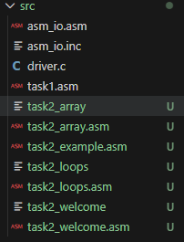
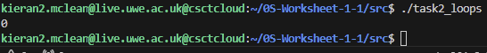

# 0S-Worksheet-1

In this Worksheet I was introduced to basic x86 assembly programming using NASM and it shows how assembly functions can be called from C.

my final code structrure looks like this


Source Code:

```c
int __attribute__((cdecl)) asm_main(void);

int main() {
    int ret_status;
    ret_status = asm_main();
    return ret_status;
}
```
### task1.asm

this is my implementations of the assembly program that adds two numbers and prints the result.

```
%include "asm_io.inc"

segment .data
    a   dd 10
    b   dd 32
    msg db "The sum is: ", 0

segment .text
    global asm_main

asm_main:
    enter 0, 0
    pusha

    mov eax, [a]
    add eax, [b]

    mov ebx, eax

    mov eax, msg
    call print_string

    mov eax, ebx
    call print_int
    call print_nl

    popa
    mov eax, 0
    leave
    ret
```


How the assembly code works?

1. Data segment
    a   dd 10
    b   dd 32
    msg db "The sum is: ", 0
a nad b are integers stored in memory.

msg is a null terminated string for printing 

2. Making the function visible to C
    global asm_main
This allows the GCC linker to find the asm_main fucntion

without this line, you get an error response:
undefined reference to 'asm_main'

3. Stack setup 
    enter0, 0
    pusha
this creates a stack frame and saves registers

4. Adding the Two integers
    mov eax, [a]
    add eax, [b]
the result is stored in eax, then moved to ebx for printing

5. Printing the output
    mov eax, msg
    call print_string

    mov eax, ebx
    call print_int
    call print_nl
These print the string and integer result using fucntioons from asm_io

6. Function exit
    popa
    mov eax, 0
    leave
    ret
restores registers and returns to the C program

7. Compilation process
the following commands were used inside hte src/directory
    nasm -f elf task1.asm -o task1.o
    nasm -f elf asm_io.asm -o asm_io.o
    gcc -m32 -c driver.c -o driver.o
    gcc -m32 driver.o task1.o asm_io.o -o task1
- -f elf builds 32-bit object files for NASM
- -m32 forces the GCC to compile 32-bit code 
- and the final line links everything together into an executable called task1

Below is the screenshot of the NASM and GCC commands used to build the program.


8. Program Output
Running the executable:
    ./task1
Output:
    the sum is: 42
This confirms the assembly program successfully added  the numbers and printed the result.

This screenshot shows the program running succesffully:

 
---What I Learned---

Completing this task i learned:
 - how to write a simple assembly rpogram using NASM
 - how to call assembly functions from a C program
 - how stack frames work with enter and leave
 - how to compuile and link multiple languages together
 - hjow to structure a project on a remote linux server
 - how to resolve linking erors such as undefined reference to asm_main
 - How to use external assembly I/O routines-
  - how to use .data amd .text segments

  ## Task 2 Control Structures, Loops, User Input, and Arrays

  task 2 required multiple small assembly programs, each demonstrating a differenct concept from Assembly Language.

  Project Structure

  
  in the image above you can see my Task 2 structure.

  # Task 2.1 - If/Else
  in this task i learne dhow to translate simple C conctrol stuctures in x86assembly. To demonstrate this i implemented the following if/else example

C Version

```
    int x = 5;
    int y;

    if (x > 3)
        y = 10;
    else
        y = 20;
```


Assembly Version (task2_example.asm)
```asm
    %include "asm_io.inc"

segment .data
    x dd 5
    y dd 0

segment .text
global asm_main

asm_main:
    enter 0,0
    pusha

    mov eax, [x]
    cmp eax, 3
    jle else_part       ; if x <= 3 → go to else

    ; THEN part
    mov dword [y], 10
    jmp endif

else_part:
    mov dword [y], 20

endif:
    mov eax, [y]
    call print_int
    call print_nl

    popa
    mov eax, 0
    leave
    ret
```

How the code works 
- cmp eax compares x with 3 
- jle  jumps to the else block if x<= 3
- If the condition is true (x > 3), the THEN block runs
- jmp endif skips over the ELSE block
- The final value stored in y is printed

This mirrors the exact behaviour of hte C if/else statement 

the program should output 10 since x = 5, the condition is true and y becomes 10


# Task 2.2 While loops 
in this task i translated a simple C while loop into assembly

C Version

```
int i = 5;

while (i > 0) {
    i = i - 1;
}
```

Assembly Version (task2_loops.asm)
```
    %include "asm_io.inc"

segment .data
    i dd 5

segment .text
global asm_main

asm_main:
    enter 0,0
    pusha

while_start:
    mov eax, [i]
    cmp eax, 0
    jle while_end      ; exit loop if i <= 0

    dec eax
    mov [i], eax
    jmp while_start

while_end:
    mov eax, [i]
    call print_int
    call print_nl

    popa
    mov eax, 0
    leave
    ret
```

How the code works
-cmp eax, 0 checks the loop condition
- jle exits the loop when i <= 0
- dec eax reduces the value of i by 1 each iteration
- the loop continues until i reaches zero
- the final value of i is printed

the program should output zero


as we can see in the image above the output was 0 because ....

# Task 2.3 welcome program with validation

This task required reading user input, validating the input, and printing a message multiple times.

The number must be between 50 and 100.
If the number is valid, a welcome message is printed that many times.

C Version
```
#include <stdio.h>

int main() {
    int count;

    printf("How many times (50–100)? ");
    scanf("%d", &count);

    if (count < 50 || count > 100) {
        printf("Error: number must be between 50 and 100.\n");
        return 0;
    }

    for (int i = 0; i < count; i++) {
        printf("Welcome!\n");
    }

    return 0;
}
```
What it does
- Reads a number from the user
- Checks if it’s 50–100
- Prints "Welcome!" that many times
- Prints an error message if invalid

assembly Version (task2_welcome.asm)
```
%include "asm_io.inc"

segment .data
    name_msg db "Welcome!", 0
    ask_count db "How many times (50–100)? ", 0
    err_msg db "Error: number must be between 50 and 100.", 0

segment .bss
    count resd 1

segment .text
global asm_main

asm_main:
    enter 0,0
    pusha

    mov eax, ask_count
    call print_string
    call read_int
    mov [count], eax

    cmp eax, 50
    jl invalid

    cmp eax, 100
    jg invalid

    mov ecx, eax
welcome_loop:
    mov eax, name_msg
    call print_string
    call print_nl
    loop welcome_loop
    jmp finish

invalid:
    mov eax, err_msg
    call print_string
    call print_nl

finish:
    popa
    mov eax, 0
    leave
    ret
```

How the assembly matches the C version
- read_int replaces scanf 
- cmp + jl + jg  replace the IF validation
- ecx loop counter + loop intruction replaces the for loop 
- Messages printed using print_string and print_nl

Output

the output would first as k the user how mnay times they want  "Welcome, Student!" to be printed. the user would then enter a number between 50-100. after they have inputted the number, the program would output "Welcome, Student!" depending on the number the user inputted.


# 2.4 Array initialisations and range sum
this was the most complex part of task 2.

The program had to:
1. create an array of 100 elements 
2. compute and print the sum of the whole array
3. ask the user for a start and end index
4. validate the input
5. compute the sum of the selected range
6. print the result

C version
```#include <stdio.h>

int main() {
    int arr[100];
    int start, end;
    int total_sum = 0;
    int range_sum = 0;

    // 1. Initialise array with values 1 to 100
    for (int i = 0; i < 100; i++) {
        arr[i] = i + 1;
    }

    // 2. Sum entire array
    for (int i = 0; i < 100; i++) {
        total_sum += arr[i];
    }

    printf("Total sum (1–100): %d\n", total_sum);

    // 3. Ask user for start and end indices
    printf("Enter start index (1–100): ");
    scanf("%d", &start);

    printf("Enter end index (1–100): ");
    scanf("%d", &end);

    // 4. Validate input
    if (start < 1 || end > 100 || start > end) {
        printf("Invalid range!\n");
        return 0;
    }

    // 5. Compute range sum
    for (int i = start - 1; i < end; i++) {
        range_sum += arr[i];
    }

    // 6. Output result
    printf("Range sum: %d\n", range_sum);

    return 0;
}
```

C code expalnations

- The array is filled manually using a loop (arr[i] = i + 1)
- The total sum is computed using another loop
- User input is read using scanf
- Validation ensures:
    start ≥ 1
    end ≤ 100
    start ≤ end
Range sum uses a loop from start-1 to end
Final result is printed


Assmebly Version (task2_array.asm)
```%include "asm_io.inc"

segment .data
    prompt_start db "Enter start index (1–100): ", 0
    prompt_end   db "Enter end index (1–100): ", 0
    invalid_msg  db "Invalid range!", 0
    total_msg    db "Total sum (1–100): ", 0
    range_msg    db "Range sum: ", 0

segment .bss
    arr resd 100
    start resd 1
    range_end resd 1

segment .text
global asm_main

asm_main:
    enter 0,0
    pusha

    ; Initialize array 1–100
    mov ecx, 100
    mov ebx, 1
init_loop:
    mov [arr + (ebx-1)*4], ebx
    inc ebx
    loop init_loop

    ; Sum entire array
    mov ecx, 100
    mov ebx, 0
    mov eax, 0
sum_loop:
    add eax, [arr + ebx*4]
    inc ebx
    loop sum_loop

    mov ebx, eax
    mov eax, total_msg
    call print_string
    mov eax, ebx
    call print_int
    call print_nl

    ; Ask for range
    mov eax, prompt_start
    call print_string
    call read_int
    mov [start], eax

    mov eax, prompt_end
    call print_string
    call read_int
    mov [range_end], eax

    ; Validate range
    mov eax, [start]
    cmp eax, 1
    jl invalid

    mov eax, [range_end]
    cmp eax, 100
    jg invalid

    mov eax, [start]
    mov ebx, [range_end]
    cmp eax, ebx
    jg invalid

    ; Compute range sum
    mov ecx, [range_end]
    sub ecx, [start]
    inc ecx

    mov eax, [start]
    dec eax
    mov ebx, eax

    mov eax, 0
range_sum_loop:
    add eax, [arr + ebx*4]
    inc ebx
    loop range_sum_loop

    mov edx, eax
    mov eax, range_msg
    call print_string
    mov eax, edx
    call print_int
    call print_nl
    jmp finish

invalid:
    mov eax, invalid_msg
    call print_string
    call print_nl

finish:
    popa
    mov eax, 0
    leave
    ret
```

How the code works
- a loop fills an array with numbers 1 - 100
- another loop computes the fulll sum 
- user enters start and end 
- several cmp + jumps validate the range
- a loop computes the sum from start to end 
- program prints results or error messages 

output example:

Total sum (1–100): 5050
Enter start index (1–100): 10
Enter end index (1–100): 20
Range sum: 165
